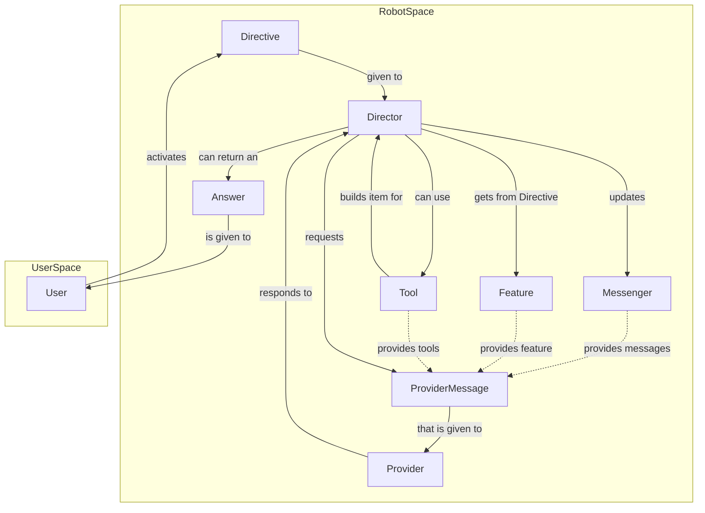

# PrivateSuperChain
This is not the public version, It will be under an organization instead.

```mermaid
graph TD
    subgraph RobotSpace
   
        Directive -->|given to| Director
        Director --->|updates | Messenger
        Director --->|can use| Tool
        Director --->|gets from Directive| Feature
        Tool -->| builds item for | Director
       
%%        Feature  --> |if available use | Provider
%%        Feature  ---> |if Failed | CRASH
        Director -->|can return an| Answer
%%        Director ---> |request| Provider
        Provider -->| responds to | Director

        Messenger -.->| provides messages | ProviderMessage
        Feature -.->| provides feature | ProviderMessage
        Tool -.->| provides tools | ProviderMessage
        
        Director --> |requests| ProviderMessage
        ProviderMessage --> |that is given to | Provider
    end
    Answer -->|is given to | User
    subgraph UserSpace
        User -->|activates| Directive
    end
```
