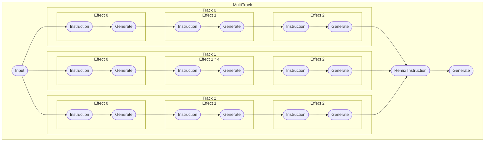

**Introduction to Mix Theory**
An example of a mix with 3 tracks, each with multiple effects, that will be remixed into one variable:


Mix Theory provides a powerful and concise way to define and execute data transformations in a functional style. 
It allows you to build complex processing pipelines with a focus on clarity and type safety.
**Key Concepts:**

* **Data Types:**
    * `Single<T>`: Represents a single value of type `T`.
    * `Multi<T>`: Represents a list of values of type `T`.
* **Transformation Functions:**
    * `MixFunction<T>`: A function that takes a `Single<T>` and returns a transformed value of the same type.
    * `RemixFunction<T>`: A function that takes a `Multi<T>` and returns a transformed value.
* **Mixable:** The base interface for all mixable entities.
    * `Effect<T>`: Applies a single `MixFunction` to the input data.
    * `Repeater<T>`: Repeats a mixable a specified number of times.
    * `Track<T>`: Sequentially applies multiple mixables.
    * `MultiTrack<T>`: Combines multiple mixables with a remix function.
    * `Mixer<T>`: Combines a mixable with a generator function for creating output.
* **Generators:**
    * `Generator<T>`: A function that takes an input and generates a value of type `T`.
* **Special:**
  * `Group<T>`: A list of mixables which cannot be mixed until remix function is added to form a `MultiTrack<T>`.

**Building Pipelines:**

1. **Define Transformations:** Use `concept` and `mix` functions to create transformation functions.
2. **Combine Mixables:** Use operators like `+`, `*`, `to`, and `using` to combine mixables into tracks or groups.
3. **Execute Mixers:** Call the `invoke` function on a `Mixer` with input data and a generator function.

**Example Usage:**

```kotlin
val pros = concept { "pros($input)" }
val cons = concept { "cons($input)" }
val summary = mix { "summary{in=$input($outputs)}" }

val mixer = (pros * 2 + cons) to summary using { it.toUpperCase() }
val result = mixer("hello")

println(result) // Output: pros(summary{in=hello([better(better(pros(hello))), cons(hello)])})
```

**Benefits:**

* **Readability:** Clear and concise syntax makes code easy to understand and maintain.
* **Type Safety:** Ensures type consistency throughout the processing pipeline.
* **Modularity:** Break down complex transformations into smaller reusable functions.